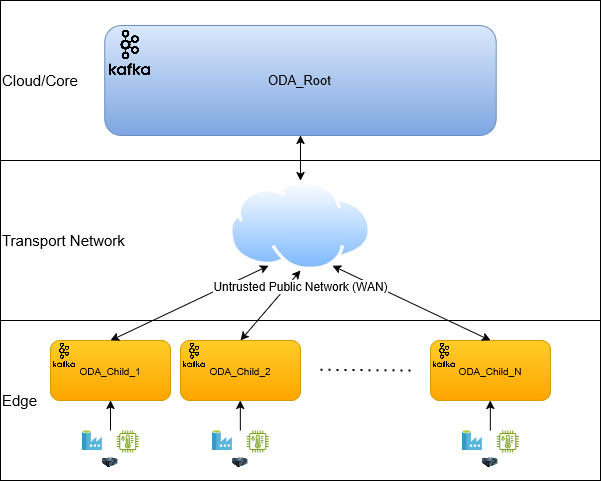
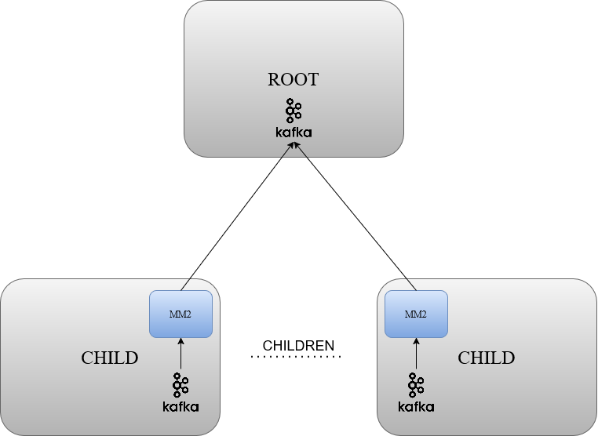
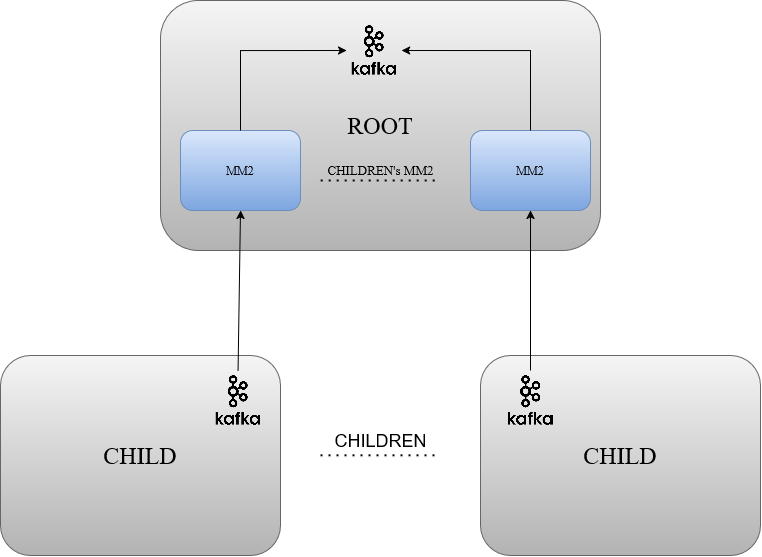
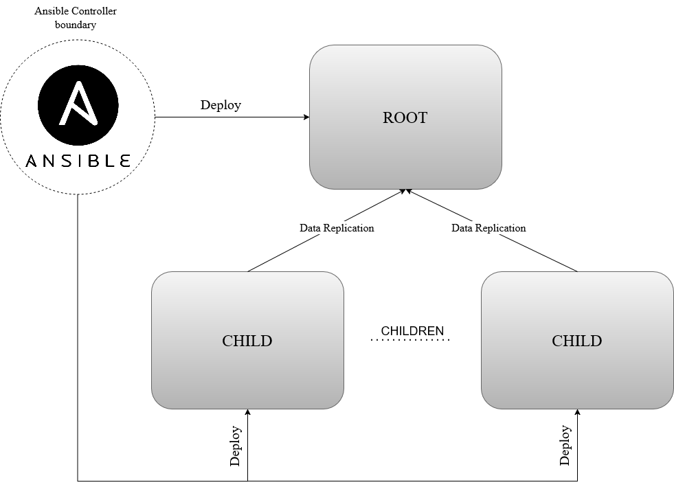
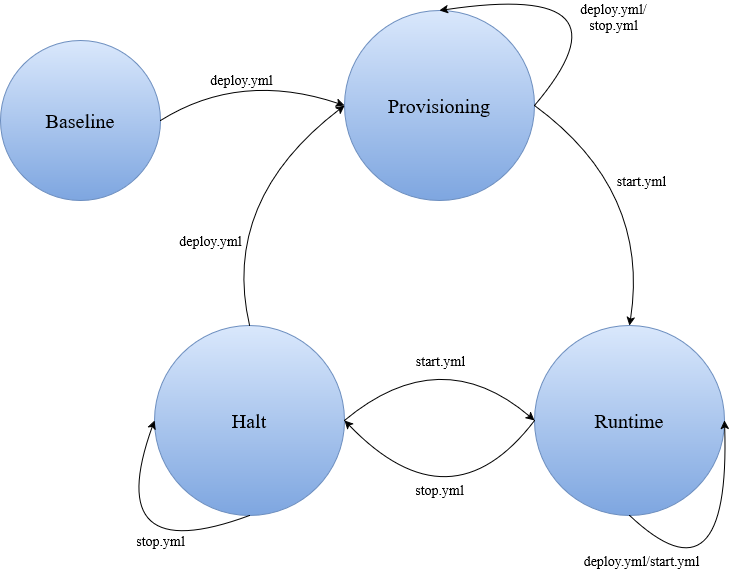
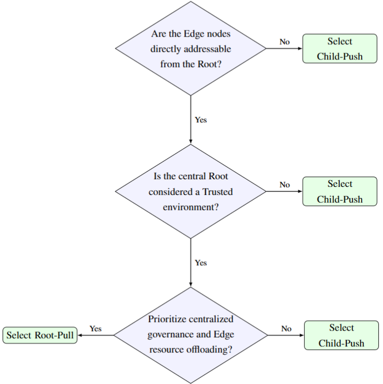

# Hierarchical ODA

## Master's Degree Thesis in Cybersecurity @ University of Pisa

The full thesis document is available at [`docs/neglia_thesis.pdf`](docs/neglia_thesis.pdf) and published [here](https://etd.adm.unipi.it/t/etd-03302026-171514).

## Project Overview
This project presents the design, implementation, and security validation of a hierarchical extension to the [**Observable Data Access (ODA)**](https://github.com/alebocci/ODA_1.1) ecosystem. The goal is to transition ODA from a standalone microservice instance into a distributed Edge-to-Cloud architecture capable of scaling across geographically dispersed locations while maintaining a robust security posture in Zero Trust environments.

<figure style="text-align: left; margin: 2rem 0;">
  
</figure>

## Architectural Duality: Child-Push vs. Root-Pull
The core of the hierarchical replication is powered by **Apache Kafka MirrorMaker 2 (MM2)**. The project explores two distinct topological approaches to data replication, differing primarily in the placement of the replication engine and the governance of the data flow:

### 1. Child-Push Topology (Decentralized Governance)
In this architecture, the MirrorMaker 2 engine is deployed on each peripheral **Child node**. The Child node acts as an active client, initiating outbound connections to "push" data to the central Root node.
- **Operational Advantage**: Simplifies edge deployment behind NAT or corporate firewalls, as only egress traffic is required from the Edge.
- **Security Trade-off**: Increases the attack surface of the Root node, which must expose its Kafka broker to inbound replication traffic.

<figure style="text-align: left; margin: 2rem 0;">
  
</figure>

### 2. Root-Pull Topology (Centralized Governance)
In this architecture, the replication engine is centralized on the **Root node**. The Root node instantiates dedicated MM2 processes for each Child, initiating connections to "pull" data from the Edge.
- **Operational Advantage**: Centralizes replication logic and topic whitelisting, reducing the configuration burden on Edge nodes.
- **Security Trade-off**: Requires Child nodes to expose their Kafka brokers to the network, shifting the exposure to the Edge.

<figure style="text-align: left; margin: 2rem 0;">
  
</figure>

## Macro-Architectural Threat Modeling
<figure style="text-align: left; margin: 2rem 0;">
  
</figure>

The system model is built upon three primary logical entities: the centralized **Ansible Controller** for IaC orchestration, the **Root Node** for data aggregation, and the distributed **Child Nodes** for edge ingestion. Two distinct logical flows traverse the infrastructure: the **Data Replication flow**, which synchronizes data from Children to Root, and the **Deploy flow**, which carries configurations from the Controller to the target nodes.

To identify vulnerabilities, a hybrid threat modeling approach was adopted, combining the **STRIDE** framework with **MITRE ATT&CK** techniques. The analysis focuses on the inter-node replication pipelines and profiles three primary adversaries:

- **Network Adversary**: Capable of intercepting, spoofing, or manipulating traffic on the untrusted transport network.
- **Malicious Observer**: An entity with limited access to the deployed nodes, attempting to leak sensitive information or credentials.
- **Compromised Administrator**: An insider or attacker who has gained local administrative privileges on a Zero Trust node.

## Infrastructure as Code Implementation
The transition to a distributed Edge-to-Cloud architecture is managed via an **Ansible**-based pipeline, following a Security-as-Code paradigm to ensure modularity, idempotency, and the prevention of configuration drift.

### Repository Structure
The deployment repository is structured to maintain a strict separation of concerns between configuration data, cryptographic assets, and execution logic:

- `ansible.cfg`: Principal configuration for the Ansible Controller, optimizing execution via SSH pipelining.
- `files/`: Repository for static assets, including `oda_base/` for microservices source and `secrets/` for the isolated mTLS Keystores and Truststores of each node.
- `group_vars/`: Centralizes the declarative state of the infrastructure (e.g., `all.yml` for global parameters and `root.yml`/`child.yml` for node-specific variables).
- `inventory/`: Maps logical node groups to actual IP addresses in `hosts.yml`, decoupling deployment logic from physical network topology.
- `playbooks/`: High-level orchestration entries for provisioning and operational management.
- `roles/`: Encapsulates the core execution logic into self-contained entities (`oda_root`, `oda_child`) that define the atomic tasks for node configuration.
- `templates/`: Hosts dynamic Jinja2 templates for Docker Compose definitions and MirrorMaker 2 configurations, compiled at runtime.
- `vault/`: Securely isolates the `.vault_pass` decryption key to keep sensitive parameters encrypted at rest.

### Playbook Orchestration and Lifecycle
The deployment follows a **Lifecycle Separation** pattern, dividing the process into three isolated phases to ensure a controlled startup, as illustrated in the State Machine Diagram below:

<figure style="text-align: left; margin: 2rem 0;">
  
</figure>

1.  **Provisioning Phase (`deploy.yml`)**: Handles system scaffolding, certificate distribution, and template rendering.
    ```bash
    ansible-playbook -i inventory/hosts.yml playbooks/deploy.yml --vault-password-file vault/.vault_pass
    ```
2.  **Runtime Phase (`start.yml`)**: Operationalizes the stack by starting containers and injecting dynamic security measures (ACLs and network quotas).
    ```bash
    ansible-playbook -i inventory/hosts.yml playbooks/start.yml
    ```
3.  **Halt Phase (`stop.yml`)**: Gracefully stops active containers while preserving volumes and application state.
    ```bash
    ansible-playbook -i inventory/hosts.yml playbooks/stop.yml
    ```

### Certificate Generation
A private PKI must be established to enable mTLS authentication between nodes. The `generate_certs.sh` script, located at the root of each architecture directory, automates the creation of a Certificate Authority, node-specific keystores, and truststores.

## Implemented Mitigations
The identified threats are addressed through a mitigation strategy favoring automated security enforcement over manual configuration.

**Transport Security**: The Deploy flow is protected by strict SSH host key verification. Inter-node Kafka communication is secured via mTLS, with a private PKI provisioning unique certificates for each node. Brokers enforce mandatory client authentication, rejecting any connection without a valid CA-signed certificate. This neutralizes the Network Adversary by preventing eavesdropping, spoofing, and MitM attacks on both management and data replication channels.

**Secret Management and File System Hardening**: To counter the Malicious Observer on Zero Trust nodes, sensitive IaC variables (keystore passwords, MM2 credentials) are encrypted at rest via Ansible Vault. During deployment, secrets are decrypted on-the-fly and materialized with strict POSIX permissions, restricting access at the OS level. This prevents credential harvesting and local information disclosure from compromised edge deployments.

**Replication Governance and Drift Control**: To contain the blast radius of a Compromised Administrator, fine-grained Kafka ACLs enforce Least Privilege, granting each node only topic-specific permissions. Network Quotas cap client bandwidth, mitigating volumetric DoS attacks. Configuration drift is reconciled through continuous Ansible execution; unauthorized modifications are automatically detected and overwritten with the trusted baseline, ensuring self-healing resilience.

## Validation and Benchmarking
The efficacy of the applied defenses was verified through:
- **Simulated Cyber-Attacks**: Active testing of mTLS enforcement, credential protection, and authorization boundaries.
- **Performance Analysis**: End-to-end replication benchmarks under a synthetic workload of 500,000 records (1 KB each).

| Metric | Child-Push Topology | Root-Pull Topology |
| :--- | ---: | ---: |
| Payload Size | 1 KB | 1 KB |
| Total Messages | 500,000 | 500,000 |
| Local Edge Ingestion | 23.92 MB/s | 25.85 MB/s |
| E2E Replication Throughput | ~1.93 MB/s | ~1.84 MB/s |
| MM2 Peak CPU (Start-up) | 86.28% | 66.07% |
| MM2 Avg CPU (Regime) | ~4–8% | ~4–7% |
| MM2 Max RAM Usage | ~379 MiB | ~332 MiB |

## Architectural Decision Tree
<figure style="text-align: left; margin: 2rem 0;">
  
</figure>

The selection between the two topologies is dictated by three cascading constraints, formalized in the decision tree above. The first is **network deployability**: if Edge nodes are not directly addressable from the Root (e.g., behind NAT), the Child-Push model is logistically mandatory. The second is **trust assumptions**: under a strict Zero Trust posture, Child-Push is preferred to logically air-gap the Edge from central Cloud breaches. The third is **governance prioritization**: when the Root is trusted and centralized control is desired, Root-Pull offloads computational overhead from resource-constrained Edge nodes and aligns with Kafka best practices.

## Limitations and Future Work
While this thesis establishes a robust security baseline at the infrastructure and transport layers, certain boundaries were deliberately drawn, highlighting natural avenues for future research:

- **Internal Microservices Security.** The baseline ODA remains treated as a trusted "black box". Future work should engineer native authentication and authorization for Data Generators and Consumers, and enforce application-layer input validation to prevent data poisoning.
- **Logging and Non-Repudiation.** To fully address the Repudiation category of STRIDE, comprehensive tamper-evident logging should be implemented across Ansible deployments, data queries, and cross-network replications.
- **Advanced Drift Remediation.** The current event-driven drift reconciliation is limited in scope. Future pipelines should integrate multi-step remediation workflows capable of handling complex scenarios without race conditions.
- **Hardware-Level Networking.** The current software VPN overlay should be complemented with enterprise-grade firewalls and dedicated routing appliances to structurally mitigate volumetric network DoS attacks.
- **Granular Secret Management.** The single master password approach should be replaced with uniquely generated passphrases for each cryptographic asset, potentially integrating dynamic key management systems.
